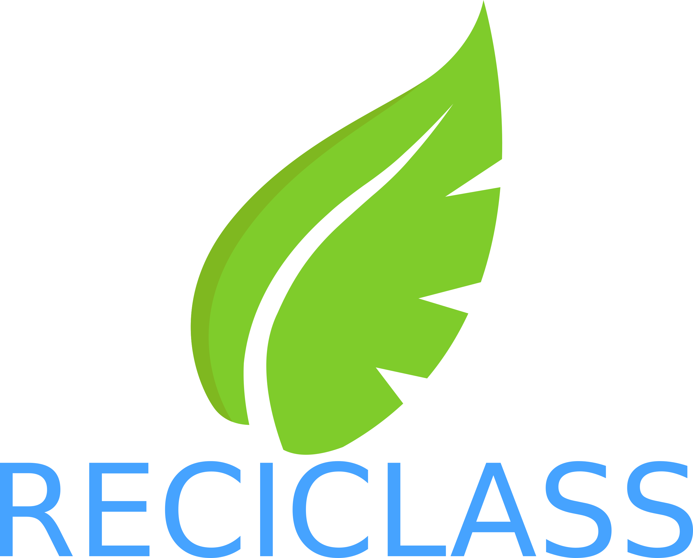
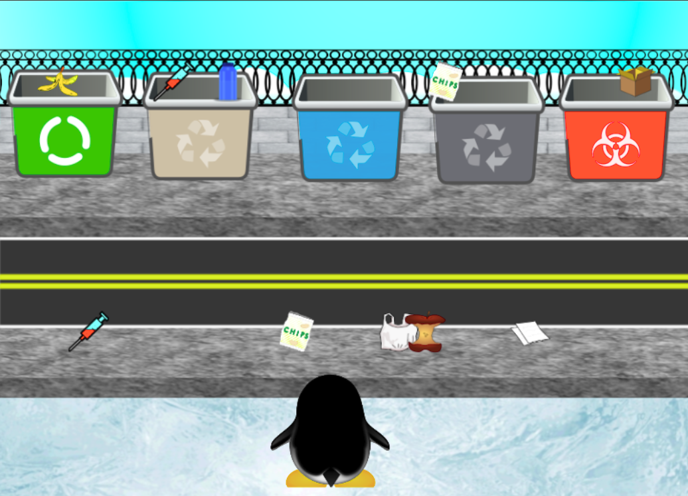
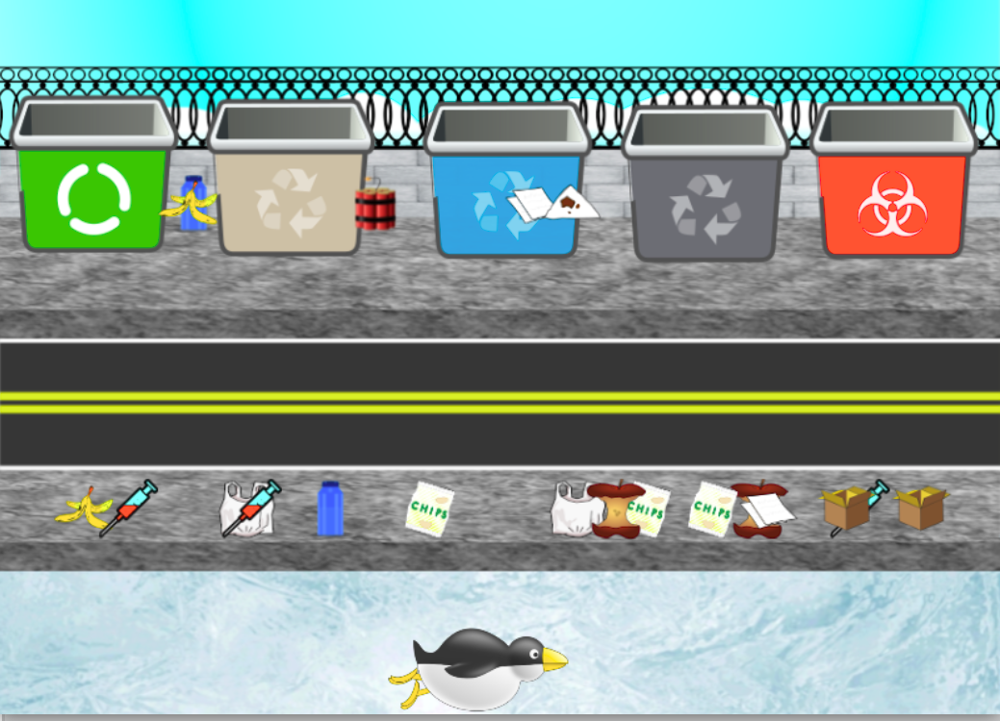
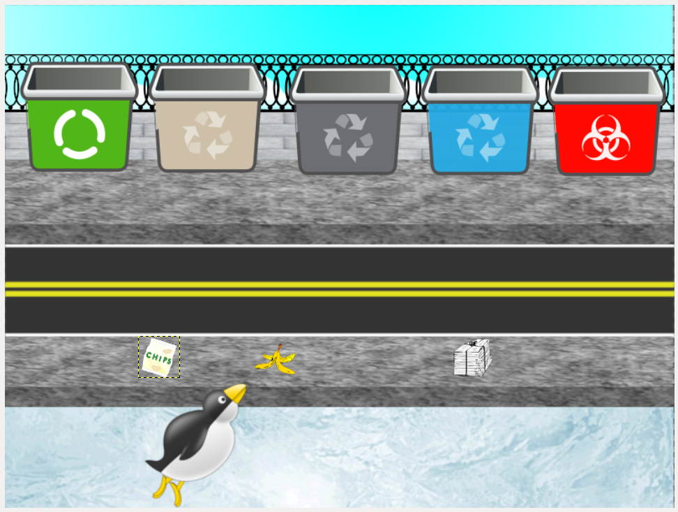

# RECICLASS

Un proyecto que te permitirá aprender a separar de manera adecuada los elementos de reciclaje.

Este proyecto va a ser un micro-juego de un portal dedicado al reciclaje con logística para el acopio de los elementos reciclados.

# Instalación

Es muy fácil!!! Necesitas https://gdevelop-app.com/download/ instalado en tu sistema y simplemente abre la ubicación **gdev** y dale click en Ejecutar.

# Sreenshots

# ¿Quieres saber más?
- [Visita](https://docs.google.com/presentation/d/1PP2JRanh1-9spOz3arJWtIaiMjaYWFlh0tp-8Y7ChNw/edit#slide=id.p)
